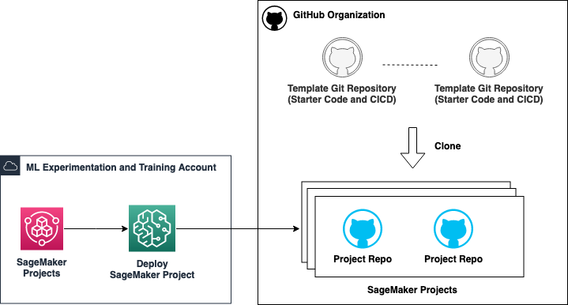

# Build an enterprise grade MLOps platfrom on AWS using Github and Terraform

## Introduction

As enterprise businesses embrace Machine Learning (ML) across their organisations, manual workflows for building, training, and deploying ML models tend to become bottlenecks to innovation. To overcome this, enterprises need to shape a clear operating model defining how multiple personas, such as Data Scientists, Data Engineers, ML Engineers, IT, and Business stakeholders, should collaborate and interact, how to separate the concerns, responsibilities and skills, and how to leverage AWS services optimally. This combination of ML and Operations, so-called MLOps, is helping companies streamline their end-to-end ML lifecycle and boost productivity of data scientists while maintaining high model accuracy and enhancing security and compliance.

## High level architecture

In this repository, we show how to use **Terraform** with **GitHub and GitHub Actions** to build a baseline infrastructure for secure MLOps. The solution can be broken down into three parts:

**Base Infrastructure**

The necessary infrastructure components for your accounts including SageMaker Studio, Networking, Permissions and SSM Parameters.

**Shared Template Repositories**

GitHub template repositories that are cloned when a custom SageMaker Project is deployed by a Data Scientist or ML Engineer.

**User Experience**

This is how the end-users (Data Scientists or ML Engineers) use SageMaker projects.

Typically, when a SageMaker project is deployed:
- GitHub private repos are created from templates that Data Scientists need to customize as per their use-case.
- These variables show best practices such as testing, approvals, and dashboards. They can be fully customized once deployed.
- Depending on the chosen SageMaker project, other project specific resources might also be created such as a dedicated S3 bucket for the project and automation to trigger ML deployment from model registry.

An architecture for the `Building, training, and deployment` project is shown below.

Currently, four example project template are available.

1. **MLOps Template for Model Building, Training, and Deployment**: ML Ops pattern to train models using SageMaker pipelines and to deploy the trained model into preproduction and production accounts. This template supports Real-time inference, Batch Inference Pipeline, and BYOC containers.

2. **MLOps Template for promoting the full ML pipeline across environments**: ML Ops pattern to shows how to take the same SageMaker pipeline across environments from dev to prod.

3. **MLOps Template for Model Building and Training**: MLOps pattern that shows a simple one-account SageMaker Pipeline setup.

4. **MLOps Template for LLM Model Building, Training and Evaluation**: MLOps pattern that shows a simple one-account SageMaker Pipeline setup for LLM models.

Based on the selected project and its setting, SageMaker projects clones GitHub repos using templates. It also sets the secrets, environment variables, and deployment environments.

## Prerequisites

The instructions here assume the following prerequisites. Make a note of these details to use in following sections.

1. AWS Account(s) with sufficient permissions to deploy base infrastructure. We recommended using at least three AWS accounts for a Dev, Preprod, and Prod environment for one business-unit. However, you can deploy the infrastructure using one account for testing purposes.
2. A GitHub Organization.
3. Personal Access Token (PAT) for GitHub organization. It is recommended to create a service/platform account and use it's PAT.

